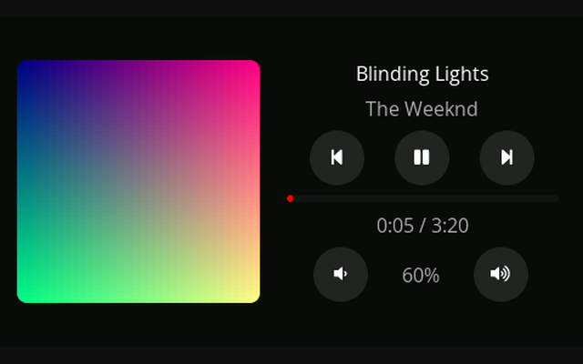
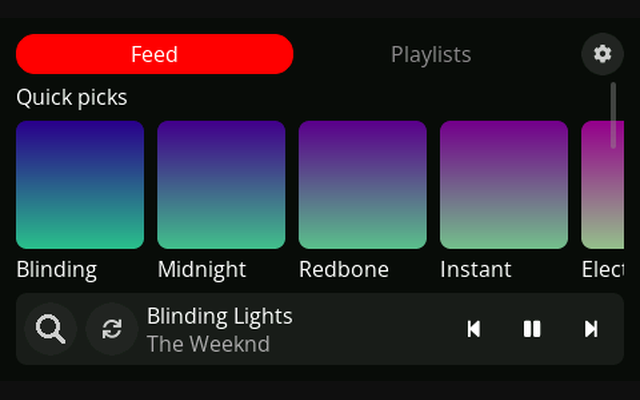
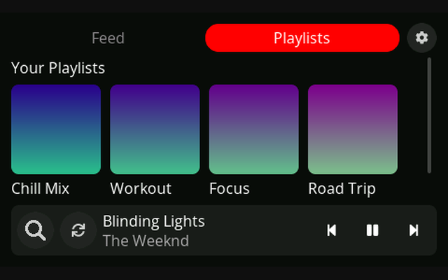
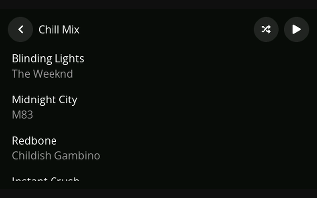
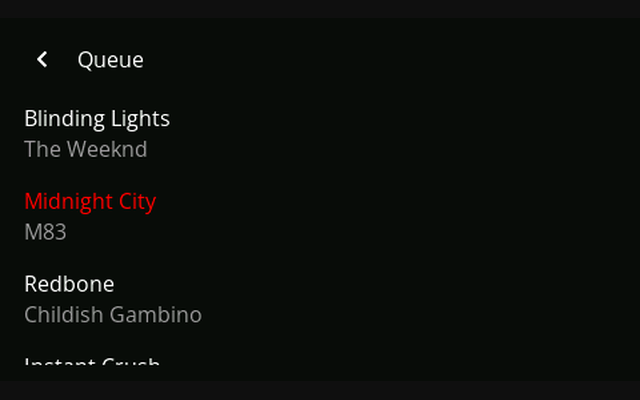

# TuneFrame

A little touchscreen that sits on your desk and shows what's playing on YouTube
Music - cover art, progress, your feed and playlists - and lets you tap to
control it. It runs on a [Guition JC4827W543](https://pl.aliexpress.com/item/1005006729377800.html)
board (ESP32-S3 + a 4.3" 480x272 **capacitive** touchscreen).

  

## Fair warning: this thing has three moving parts

An ESP32 can't log into YouTube Music or play its DRM-protected audio, so it
can't be a standalone player, or even lean on an official API, since there isn't one. 
I decided that the best way around how closed YouTube Music is would be to 
use an extension to directly control the browser via outside commands. 
In practice that means three pieces have to be running:

1. a **browser extension** that reads YouTube Music in your browser,
2. a small **bridge app** on your PC that shuttles data between the browser and
   the board,
3. the **firmware** on the board that draws the UI and sends your taps back.

Yes, it's more of a hustle than it would be if I just swapped to Spotify. No, I
couldn't find a nicer way around the login/DRM wall. The upside: it works.

## What it does

- Now playing: title, artist, cover art, progress, volume, transport controls
- Home feed: Quick picks, recently played, and your playlists (with thumbnails)
- Playlist view: the track list, plus shuffle / play buttons
- Play queue you can scroll and tap to jump around
- Search (focuses the search box in your YouTube Music tab)
- Settings: interface language (EN / PL / ES / DE / FR) and portrait / landscape
  orientation - both saved across reboots (changing either takes a restart)

## Screens

  
  
   
  
  

## Setup

All three parts run on the same PC.

### 1. Extension
Install **TuneFrame** from the
[Chrome Web Store](https://chromewebstore.google.com/detail/kgipfipidjcmkkcejpfnfkekbcnmjpnh),
then open `music.youtube.com` and sign in. The
extension only ever touches `music.youtube.com`. 
I will list supported browsers when I get them tested and work on any kinks that show up.

### 2. Bridge
Download `tuneframe-bridge.zip` from the [latest release](https://github.com/loonek/TuneFrame/releases),
unzip it and run `tuneframe-bridge.exe`. It sits in the system tray and
auto-detects the board's USB port; right-click the icon for **Reconnect**,
**Port**, a **Diagnostics** window and a **Run on startup** toggle. Rather run it
from source? See [`pc-helper/`](pc-helper/).

### 3. Firmware
Flash it straight from your browser:
**https://loonek.github.io/TuneFrame/**
Plug in the board, click Install, pick its serial port.

## Want to check it out first?

The UI is the *actual firmware* compiled against SDL2, so you can click through
every screen on your PC. Download `tuneframe-sim.zip` from the
[latest release](https://github.com/loonek/TuneFrame/releases), unzip and run
`sim.exe` (SPACE toggles now playing, Q the queue, P a playlist). To build it
yourself, see [`sim/`](sim/).

## Building it yourself

- **Firmware** - [PlatformIO](https://platformio.org): `pio run -e jc4827w543 -t upload`
- **Bridge** - Python 3.9+: `pip install -r pc-helper/requirements.txt` then `python pc-helper/bridge.py`
- **Simulator** - MSYS2 UCRT64 + CMake + SDL2 (details in [`sim/`](sim/))

## Case
Due to space constraints I'm not able to have my own 3D printer, hence the prototyping takes some time.
First I plan to finish the design of a plain one, then work on supporting external buttons for easier, tactile navigation.

## Testing without a board

You can exercise the whole chain (extension -> bridge -> display) with no
hardware, using the simulator in live mode:

1. Bridge in TCP mode: `python pc-helper/bridge.py --tcp`
2. Simulator in live mode: `sim.exe live` (from the release, or your own build)
3. Load the extension and open a signed-in `music.youtube.com` tab

Play something and it appears on the simulated screen; taps in the simulator run
back in the tab. This is also how the extension can be reviewed without the board.

## Known rough edges

- The bundled font is Latin-only, so non-Latin titles (Cyrillic, CJK, ...) show
  up as little empty boxes. It's due to the board's memory size, and I haven't gotten to think about it yet.
- All three parts have to be running together, but it seems that the extension is naturally a weak link.
  Most issues with connection are solved by reloading the YouTube Music page.
- Tested mostly on the Opera browser and the capacitive-touch version of the board.

## Privacy

The extension reads your YouTube Music playback and library and sends it **only**
to the bridge running locally on your own machine. Nothing goes to me or any
third party. Full text: [privacy policy](https://loonek.github.io/TuneFrame/privacy.html).

## License

[GPL-3.0](LICENSE) - free to use, tinker with and share; any distributed
version has to stay open under the same license.

## Disclaimer

TuneFrame is an independent, unofficial project. It is not affiliated with,
authorized by, endorsed by, or connected to Google LLC, YouTube, or YouTube Music.

"Google", "YouTube" and "YouTube Music", along with related names and logos, are
trademarks of their respective owners and are used here for identification only.

TuneFrame is provided "as is", without warranty of any kind; you use it at your own
risk (see the [GPL-3.0 license](LICENSE), sections 15 and 16).
